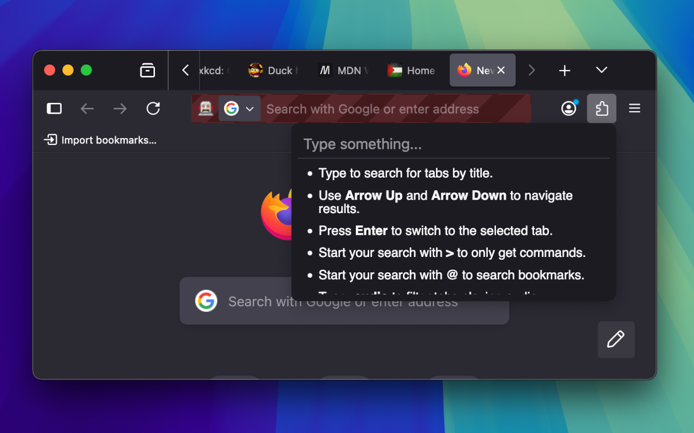
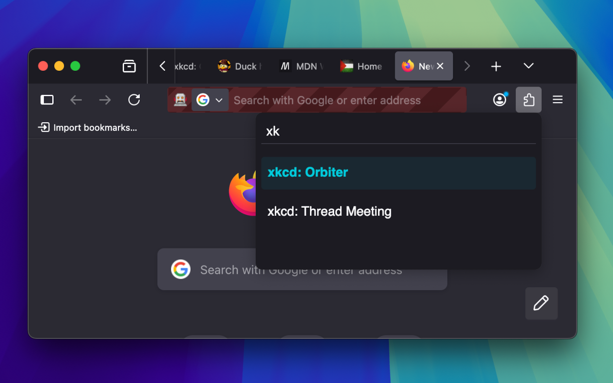
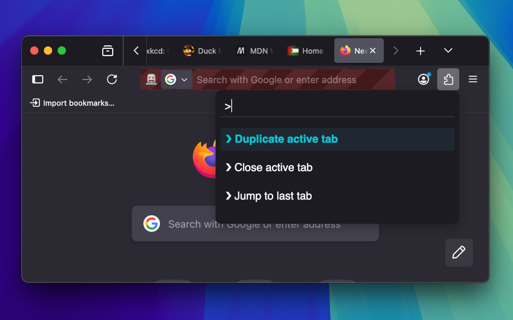

# Omnibox Browser Extension

A browser extension that adds a command palette to the browser.

- [Why](#why)
- [Feature set](#feature-set)
  - [Search your tabs](#search-your-tabs)
  - [Execute commands](#execute-commands)
  - [Audio search](#audio-search)
- [Installation](#installation)
- [Settings](#settings)
- [FAQ](#faq)

## Why

We all know the feeling: After a lenghty research session we've got a million tabs open relating to various aspects of our current task. And while it might be interesting to stare at this visual representation of our train of thought, finding anything specific in the mess left behind is often a nightmare.

Different browsers have different solutions for this. So do most IDEs.

This extensions aims to provide a unified, accessible control scheme for all browser, modelled after common shortcuts used in popular IDEs.

## Feature set

### Search your tabs
> The default behaviour of omnibox is to fuzzy search through all you open tabs for matches to your query. This does include tabs that are hidden through extensions such as [Simple Tab Groups](https://github.com/Drive4ik/simple-tab-groups) but won't show any tabs in incognito windows.

### Execute commands
> This includes closing tabs (other tabs, tabs to the left or right, etc.) as well as most other features normally offered by right-clicking a tab in your browser.

### Audio search
> This modifier allows you to find any tabs that are currently playing audio.

## Installation

The easiest way to install the extension is through the extension stores of your browser

- [Firefox](https://addons.mozilla.org/en-US/firefox/addon/omnibox/)

## Settings

**Alt + P**
> This opens the main omnibox dialog.

**Alt + Shift + P**
> This opens the main omnibox dialog but already prefilled for entering commands.

## FAQ

1. Can I change the keyboard shortcuts?
> Yes! [Firefox](https://support.mozilla.org/en-US/kb/manage-extension-shortcuts-firefox)

## Screenshots

